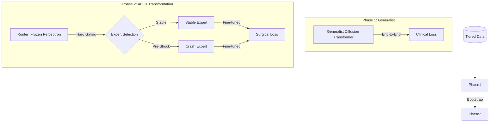

# APEX-MoE: Advanced Phase-Locked Expert Mixture for ICU Forecasting

[](#)
[](#)
[](LICENSE)

An industrial-grade research framework for predicting critical clinical events (Sepsis/Septic Shock) using high-frequency ICU time-series. APEX-MoE leverages **Transformer-based Diffusion Models** with a **Phase-Locked Mixture of Experts** to handle the heterogeneous nature of patient transitions between stability and physiological crash.

---

## 🏗️ System Architecture

The core philosophy of APEX-MoE is **Perceptual Continuity vs. Specialized Reaction**. The system splits forecasting into two distinct training phases:



---

## 🛡️ Robust Data Infrastructure

APEX-MoE features an automated, tiered data acquisition pipeline that ensures research continuity regardless of local environment state.

| Tier | Source | Priority | Description |
| :--- | :--- | :--- | :--- |
| **0** | Local Storage | ⚡ Immediate | Uses lightning-fast SoA LMDB files from `./data`. |
| **1** | Hugging Face | ⬇️ Auto-Fallback | Downloads pre-built datasets from `hellxhell/sepsis-icu`. |
| **2** | Kaggle Raw | 🛠️ Full Build | Ultimate fallback: Downloads raw PSV and builds LMDBs locally. |

---

## 🚀 Quick Start

### 1. Installation
```powershell
# Clone and install dependencies
git clone https://github.com/hellxhell/icu-research.git
cd icu-research
pip install -r requirements.txt
```

### 2. Phase 1: Training the Generalist
The Generalist establishes semantic understanding of ICU trajectories.
```powershell
python icu/train/train_generalist.py
```

### 3. Phase 2: Specialist Fine-Tuning (APEX-MoE)
Specializes the diffusion experts for "Stable" vs. "Pre-Shock" scenarios.
```powershell
# Update 'pretrained_path' in conf/train/specialist.yaml first
python icu/train/train_specialist.py
```

---

## 📚 Documentation Deep-Dive

*   [**Architecture Details**](docs/ARCHITECTURE.md): Deep dive into the Diffusion Transformer and MoE Routing logic.
*   [**Data Specification**](docs/DATA.md): Details on features, normalization, and SoA LMDB format.
*   [**Training Guide**](docs/TRAINING.md): Comprehensive instructions for Hydra, W&B, and EMA setup.
*   [**Development & Testing**](docs/DEVELOPMENT.md): Project structure and integration testing protocols.

---

## 🛠️ Maintained by
**Team Redhot** - Advanced Agentic Coding Research.
